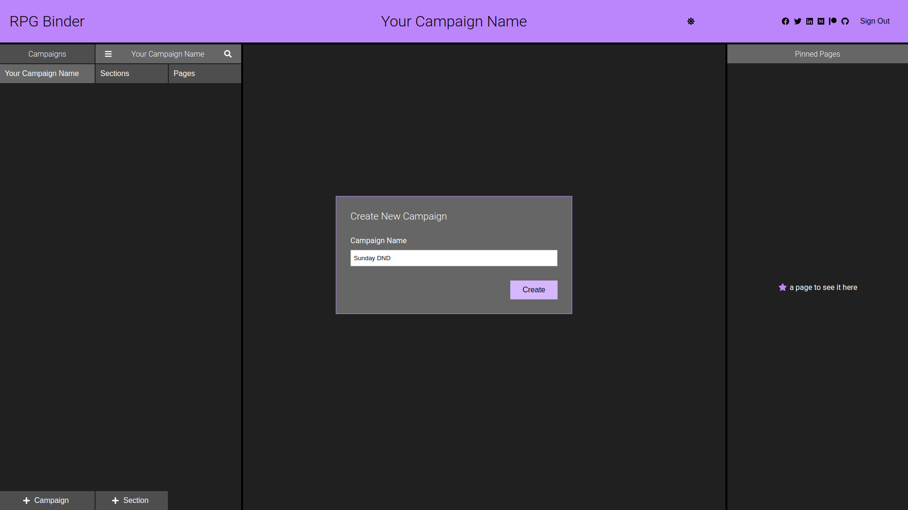
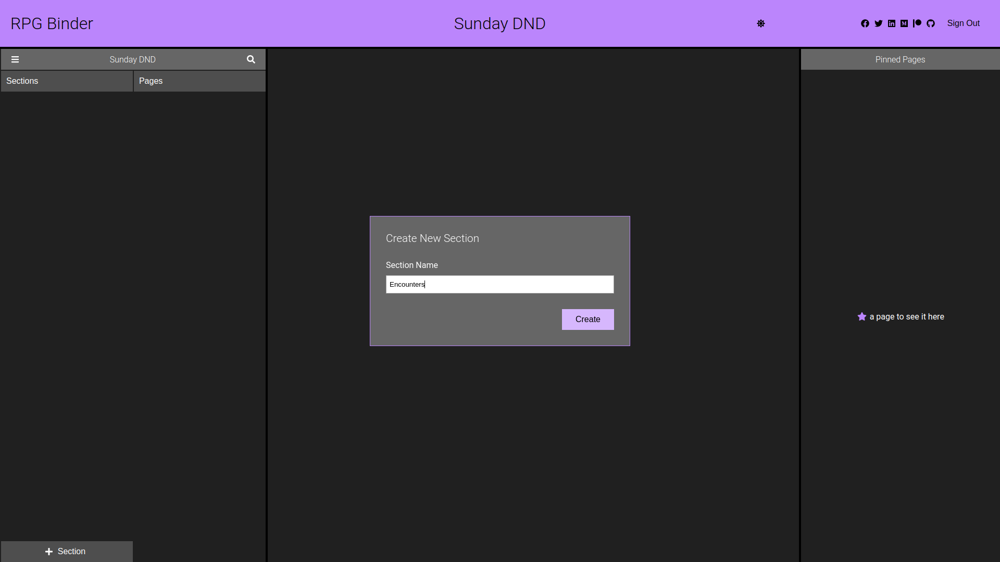
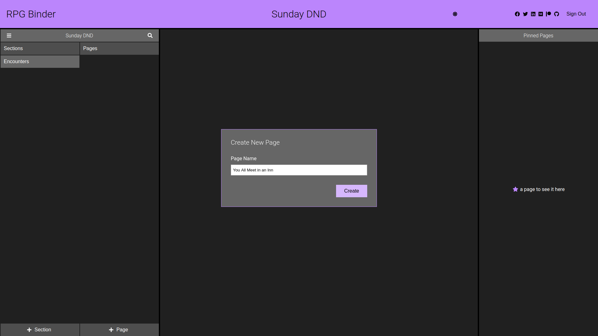
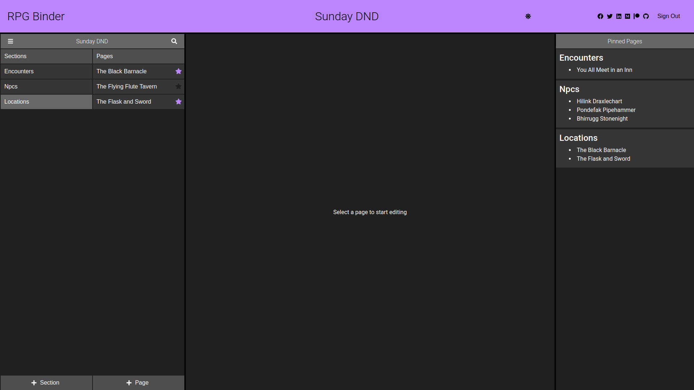
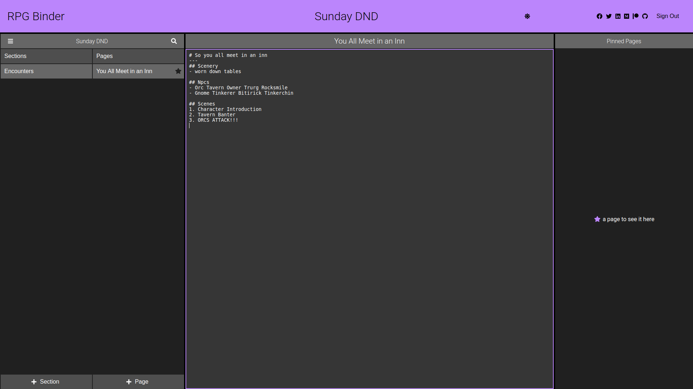
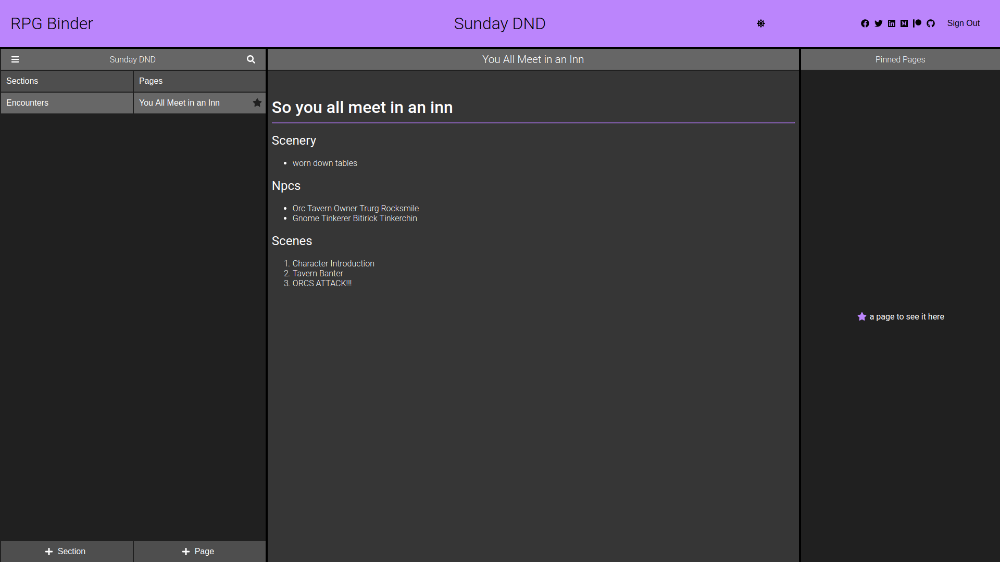
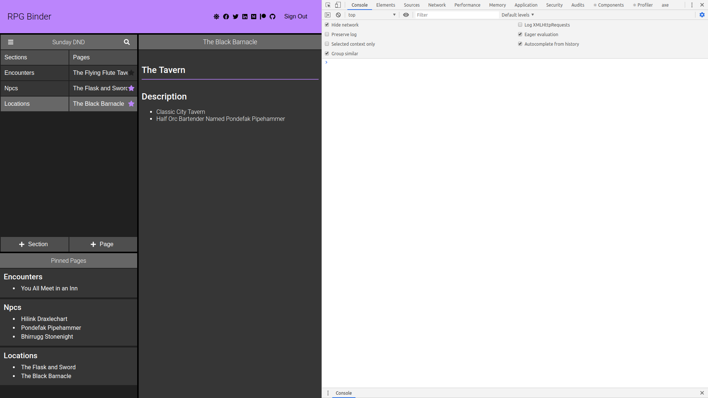
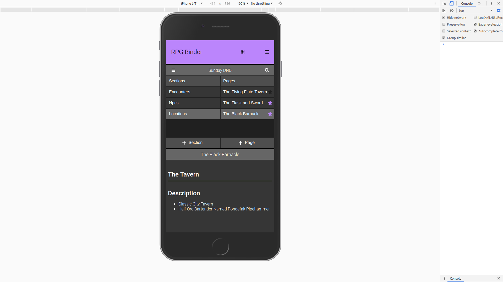
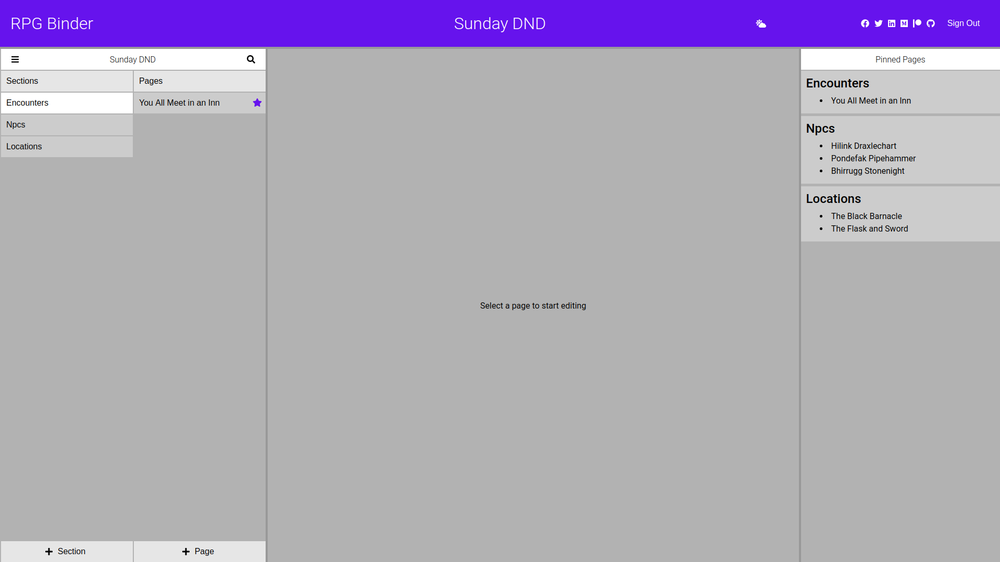

# RPG Binder
A note taking web app designed to help rpg players and game masters organize their game notes

# Demo

go to https://rpg-binder.herokuapp.com/ to see the app and create an account or see the screenshots below

# Installation

# Tech/Framework
1. [Apollo-Server](https://www.apollographql.com/docs/apollo-server/)
1. [Apollo-Client](https://www.apollographql.com/docs/react/)
1. React + Context + Hooks
1. Heroku
1. Node
1. Graphql
1. Typescript
1. Styled Components w/ Styled Theming
1. React Transition Group
1. JWT Authentication
1. Mongoose/MongoDB
1. Xstate
1. Cypress E2E Testing

## Other Libraries

1. [combine-classes](https://github.com/BrooklinJazz/combine-classes#readme) My first npm package!
1. [react-tooltip](https://www.npmjs.com/package/react-tooltip)
1. [polished](https://github.com/styled-components/polished)
1. [react-contextmenu](https://github.com/vkbansal/react-contextmenu)
# Features
## Campaigns
Organize all of your notes according to your campaigns

## Sections
Group your notes by section. If you're running DND or Pathfinder You might want to check out [Sly Flourish's Lazy Dungeon Master](https://slyflourish.com/lazydm/) for inspiration on how to group your notes

## Pages
Create "Pages" in your binder that store your game notes. A page might be all of the info for an NPC, Location, or the entire Session!

## Pinned Pages
pin pages so that they stay in the sidebar on the right. You might pin important information for your session so that you can access them quicker.

## Markdown Content Editing
Edit your pages using markdown

Here's my favourite [Markdown Cheetsheet](https://github.com/adam-p/markdown-here/wiki/Markdown-Cheatsheet) if you want to know how to make headers, links, images, or anything else with markdown

## Responsive Styles
### Small Screen

### Mobile

## Dark & Light Mode

# Special Thanks
Thank you to my awesome players, friends, & mentors for your feedback and support.